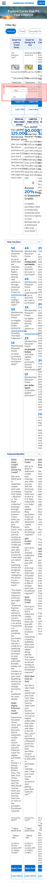

# screencapture-rv-nodejs

### Investigation Summary

**During my investigation of the Red Ventures pages, I found 8 different types of templates. Below is a detailed list and definition of each template, followed by a breakdown of the pages using these templates along with their screenshots.**

### 1. **Standard Card Layout Template**

**Definition**: 
This template is used for pages that provide detailed information about specific credit cards, including their benefits, application process, and terms. It typically features a prominent header, sections for card benefits, application buttons, and user testimonials or reviews.

**Common Features**:
- **Header**: Contains branding and navigation links.
- **Main Section**: Detailed card benefits, rewards information, and application button.
- **Footer**: Contact information, legal disclaimers, and additional links.
- **Responsive Design**: Adapts to both desktop and mobile views, often with a single column layout for mobile.

**Pages Using This Template**:

#### `/m/` Only Pages:
- **Page: [Delta Blue Credit Card](https://card.americanexpress.com/m/delta-blue-credit-card/)**
  - Mobile View: 

- **Page: [Amex Everyday Credit Card](https://card.americanexpress.com/m/cm/amex-everyday-credit-card/)**
  - Mobile View: 

- **Page: [Hilton Honors Surpass Credit Card](https://card.americanexpress.com/m/hilton-honors-surpass-credit-card/)**
  - Mobile View: 

- **Page: [Hilton Honors Aspire Credit Card](https://card.americanexpress.com/m/hilton-honors-aspire-credit-card/)**
  - Mobile View: 

- **Page: [Delta Credit Card](https://card.americanexpress.com/m/cm/delta/)**
  - Mobile View: 

- **Page: [Blue Cash Everyday Credit Card](https://card.americanexpress.com/m/blue-cash-everyday-credit-card/)**
  - Mobile View: 

#### `/d/` Pages:
- **Page: [Hilton](https://card.americanexpress.com/d/cm/hilton/)**
  - Desktop View: 
  - Mobile View: 

- **Page: [Cash Magnet Credit Card](https://card.americanexpress.com/d/cash-magnet-credit-card/)**
  - Desktop View: 
  - Mobile View: 

- **Page: [Delta](https://card.americanexpress.com/d/cm/delta/)**
  - Desktop View: 
  - Mobile View: 

- **Page: [Platinum Card](https://card.americanexpress.com/d/cm/platinum-card/)**
  - Desktop View: 
  - Mobile View: 

- **Page: [Blue Cash Everyday Credit Card 2](https://card.americanexpress.com/d/cm/blue-cash-everyday-credit-card-2/)**
  - Desktop View: 
  - Mobile View: 

- **Page: [Green Card](https://card.americanexpress.com/d/cm/green-card/)**
  - Desktop View: 
  - Mobile View: 

- **Page: [American Express](https://card.americanexpress.com/d/cm/american-express/)**
  - Desktop View: 
  - Mobile View: 

- **Page: [Blue Cash Preferred](https://card.americanexpress.com/d/cm/blue-cash-preferred/)**
  - Desktop View: 
  - Mobile View: 

- **Page: [Bonvoy Bevy Credit Card](https://card.americanexpress.com/d/cm/bonvoy-bevy-credit-card/)**
  - Desktop View: 
  - Mobile View: 

---

### 2. **Comparison Layout Template**

**Definition**: 
This template is used for pages that allow users to compare multiple credit cards side-by-side. It includes comparison tables that highlight the differences in card benefits, rewards, fees, and other key features.

**Common Features**:
- **Header**: Contains branding and navigation links.
- **Comparison Table**: Side-by-side comparison of card features and benefits.
- **Footer**: Contact information, legal disclaimers, and additional links.
- **Responsive Design**: Ensures comparison tables are readable and usable on both desktop and mobile devices.

**Pages Using This Template**:

#### `/d/` Pages:
- **Page: [Cash Magnet Credit Card Compare](https://card.americanexpress.com/d/cm/cash-magnet-credit-card-compare/)**
  - Desktop View: 
  - Mobile View: 

- **Page: [Green Card Compare](https://card.americanexpress.com/d/cm/green-card-compare/)**
  - Desktop View: 
  - Mobile View: 

- **Page: [Delta Compare](https://card.americanexpress.com/d/delta-compare/)**
  - Desktop View: 
  - Mobile View: 

- **Page: [Blue Cash Preferred Credit Card Compare](https://card.americanexpress.com/d/blue-cash-preferred-credit-card-compare/)**
  - Desktop View: 
  - Mobile View: 

#### `/m/` Only Pages:
- **Page: [Compare Dual](https://card.americanexpress.com/m/compare/dual/)**
  - Mobile View: 

#### `/d/` Pages:
- **Page: [Compare Cards](https://card.americanexpress.com/d/compare-cards/)**
  - Desktop View: 
  - Mobile View: 

---

### 3. **Multi-Filter and Advanced Layout Template**

**Definition**: 
This template is designed for pages that offer advanced filtering options for users to select and compare various credit cards. It often includes interactive elements and multiple sections to help users refine their choices.

**Common Features**:
- **Header**: Contains branding and navigation links.
- **Filter Options**: Advanced filtering tools to narrow down card choices based on user preferences.
- **Results Section**: Displays filtered card options with key details.
- **Footer**: Contact information, legal disclaimers, and additional links.
- **Responsive Design**: Ensures filter options and results are accessible on both desktop and mobile devices.

**Pages Using This Template**:

#### `/d/` Pages:
- **Page: [Multi Filters](https://card.americanexpress.com/d/multi-filters/)**
  - Desktop View: 
  - Mobile View: 

- **Page: [Multi-v2](https://card.americanexpress.com/d/american-express/multi-v2/)**
  - Desktop View: 
  - Mobile View: 

#### `/m/` Only Pages:
- **Page: [Filters](https://card.americanexpress.com/m/filters/)**
  - Mobile View: 

- **Page: [Multi Filters](https://card.americanexpress.com/d/american-express/?jo_/?exp=1097)**
  - Desktop View: 
  - Mobile View: 

- **Page: [Multi-v2](https://card.americanexpress.com/d/american-express/?exp=788)**
  - Desktop View: 
  - Mobile View: 

- **Page: [Triple Card Filter Everyday](https://card.americanexpress.com/d/triple-card-filter-everyday/)**
  - Desktop View: 
  - Mobile View: 

- **Page: [Triple Card Filter](https://card.americanexpress.com/d/triple-card-filter/)**
  - Desktop View: 
  - Mobile View: 

---

### 4. **Legal and Terms Template**

**Definition**: 
This template is used for pages that present legal information, terms and conditions, and other regulatory content. It focuses on readability and clarity, ensuring users can easily find and understand the legal details.

**Common Features**:
- **Header**: Contains branding and navigation links.
- **Main Content**: Detailed legal information, terms, and conditions.
- **Footer**: Contact information, legal disclaimers, and additional links.
- **Responsive Design**: Maintains readability and accessibility on both desktop and mobile devices.

**Pages Using This Template**:

#### `/m/` Only Pages:
- **Page: [Blue Terms](https://card.americanexpress.com/m/cm/blue-terms/)**
  - Mobile View: 

#### `/d/` Pages:
- **Page: [Blue Terms](https://card.americanexpress.com/d/cm/blue-terms/)**
  - Desktop View: 
  - Mobile View: 

---

### 5. **Login Template**

**Definition**: 
This template is designed for login pages that provide secure access to user accounts. It includes forms for user credentials and security features to ensure safe login.

**Common Features**:
- **Header**: Contains branding and navigation links.
- **Login Form**: Fields for username and password, and options for password recovery.
- **Security Features**: Information on security measures and tips for secure login.
- **Footer**: Contact information, legal disclaimers, and additional links.
- **Responsive Design**: Ensures the login form is accessible and user-friendly on both desktop and mobile devices.

**Pages Using This Template**:

#### `/d/` Pages:
- **Page: [Supp Login](https://card.americanexpress.com/d/cm/supp-login/)**
  - Desktop View: 
  - Mobile View: 

---

### 6. **Recommendation Engine Template**

**Definition**: 
This template is used for pages that provide personalized credit card recommendations based on user input and preferences. It features forms for collecting user information and displaying tailored card suggestions.

**Common Features**:
- **Header**: Contains branding and navigation links.
- **User Input Form**: Fields for collecting user preferences and information.
- **Recommendations Section**: Personalized credit card suggestions based on user input.
- **Footer**: Contact information, legal disclaimers, and additional links.
- **Responsive Design**: Ensures the form and recommendations are accessible on both desktop and mobile devices.

**Pages Using This Template**:

#### `/m/` Only Pages:
- **Page: [American Express Recommend](https://card.americanexpress.com/m/cm/american-express/recommend/)**
  - Mobile View: 

---

### 7. **Travel-Focused Template**

**Definition**: 
This template is designed for pages that highlight travel benefits and options available to credit card users. It includes sections for destinations, booking options, and travel rewards.

**Common Features**:
- **Header**: Contains branding and navigation links.
- **Main Section**: Information on travel benefits, destinations, and booking options.
- **Footer**: Contact information, legal disclaimers, and additional links.
- **Responsive Design**: Ensures travel information and booking options are accessible on both desktop and mobile devices.

**Pages Using This Template**:

#### `/d/` Pages:
- **Page: [Travel](https://card.americanexpress.com/d/travel/)**
  - Desktop View: 
  - Mobile View: 

---

### 8. **Premium Benefits Template**

**Definition**: 
This template is used for pages that showcase premium credit cards with exclusive benefits and rewards. It features detailed descriptions of luxury benefits, rewards programs, and application options.

**Common Features**:
- **Header**: Contains branding and navigation links.
- **Main Section**: Detailed information on premium benefits, rewards programs, and application options.
- **Footer**: Contact information, legal disclaimers, and additional links.
- **Responsive Design**: Ensures premium benefits information is accessible on both desktop and mobile devices.

**Pages Using This Template**:

#### `/m/` Only Pages:
- **Page: [Gold Card Light](https://card.americanexpress.com/m/gold-card/light/)**
  - Mobile View: 

#### `/d/` Pages:
- **Page: [Rose Gold Card](https://card.americanexpress.com/d/rose-gold-card/)**
  - Desktop View: 
  - Mobile View: 

---

This comprehensive analysis and breakdown should help identify the number of unique templates required and the common components shared across different pages.
